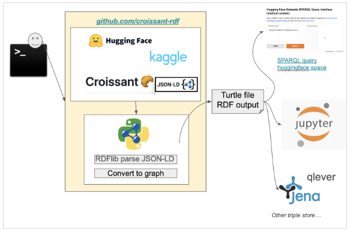
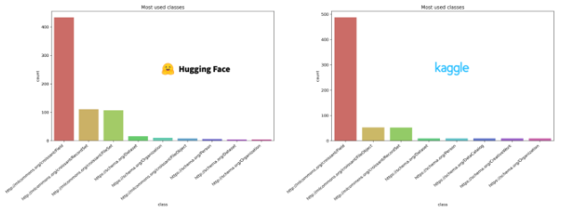
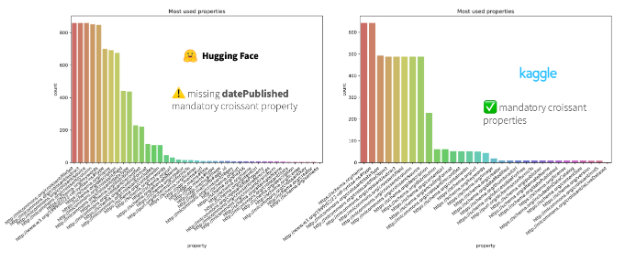

<!--

The paper.md, bibtex and figure file can be found in this repo:

  https://github.com/journal-of-research-objects/Example-BioHackrXiv-Paper

To modify, please clone the repo. You can generate PDF of the paper by
pasting above link (or yours) in

  http://biohackrxiv.genenetwork.org/

-->

# Abstract

To advance the use of machine learning to address humanity’s grand challenges such as the  understanding of disease conditions and biodiversity loss in the anthropocene, 
it is important to promote FAIR AI-ready datasets, since data scientists and bioinformaticians spend 80% of their time in data finding and preparation. 
Metadata descriptors for datasets are pivotal for the creation of machine learning models as they facilitate the definition of strategies for data discovery, feature selection, data cleaning, and data pre-processing. 
ML-ready datasets, whether by design or after pre-processing, can be enriched with metadata so they become FAIRer, i.e., autonomously discoverable and processable by machines (machine-actionable). 
Croissant ML is an extension of schema.org to better describe ML-ready datasets, released early 2024 and already adopted by some ML-model platforms such as Hugging Face (see Croissant ML viewer documentation) and OpenML. 
However, as it commonly happens with metadata, there are some limitations to the amount of metadata that can be automatically extracted. How much Croissant metadata can be programmatically extracted from ML-ready datasets? 
And how could this automation be improved? In this project, we explored answers to these two questions.

# Introduction

Our aim for the BioHackathon Europe 2024 was to assess, understand, and compare the [Croissant ML](https://docs.mlcommons.org/croissant/docs/croissant-spec.html) [@akhtar_croissant_2024] metadata description status of machine learning (ML) datasets from major data providers 
involving [Hugging Face](https://huggingface.co/), [Kaggle](https://www.kaggle.com/), and [OpenML](https://www.openml.org/) [@vanschoren_openml_2014]. 
Croissant is a high-level metadata schema based on schema.org to describe ML datasets, including types for file objects, file sets, record sets, and fields. 
Hugging Face is a platform hosting ML models and datasets, and providing an environment to run the ML models allowing users to showcase their work. 
Kaggle is well-known for its use in challenges; it offers a repository of competitions, datasets, ML models, and corresponding code. 
OpenML is a platform hosting ML models and datasets with enough details (e.g., dataset features, evaluation approach, ML task) to facilitate reproducibility. 
Although there is overlap, each registry has its own particular purpose. 
Our approach was to use Semantic Web technologies to represent, store and reuse the metadata automatically retrieved from these registries for secondary analysis of its status. 
Here, we describe the proof-of-concept developed during the BioHackathon with preliminary results on the AI-readiness of datasets.

# Developments during the BioHackathon

## croissant-rdf PyPI package

[croissant-rdf](https://pypi.org/project/croissant-rdf/) is a Python tool that fetches croissant metadata from datasets and exposes it in RDF format for integration with Semantic Web technologies. 
It retrieves datasets from either Hugging Face or Kaggle based on user selection, extracting Croissant metadata for each dataset using the respective APIs. 
The tool then processes the metadata and converts it into a Turtle (.ttl) RDF file using the [RDFLib](https://github.com/RDFLib/rdflib) library. 
This involves chunking the data, converting it into JSON-LD dormant and serializing it as RDF triples. 
The resulting RDF file provides a structured, machine-readable format for easier integration with SPARQL endpoints. 
Figure 1 illustrates the workflow we used to generate the croissant metadata RDF knowledge graph.

Key improvements were made to the [croissant-rdf GitHub repository] (https://github.com/david4096/croissant-rdf) during the hackathon. 
An MIT license was added to ensure open-source collaboration, and comprehensive docstrings were included in the scripts for better code clarity and maintainability. 
A [tqdm](https://pypi.org/project/tqdm/) progress bar was implemented to track the progress of fetching data from Hugging Face and monitor the RDF conversion process to improve user experience while executing the workflow. 
To enable reproducibility and reusability of our work, a Dockerfile was created to streamline setting up the development environment, featuring a Jupyter Notebook setup using the python:3.9-slim image, installing necessary dependencies and packages. 
The Dockerfile starts the notebook server and users can now run the project inside a Docker container using a simple one-line command.
The Docker container supports both the huggingface-rdf and kaggle-rdf making it easy to work in a consistent environment.

Currently, there are 21 issues that have not been addressed yet, though several issues were resolved during the hackathon. 
Updates include the addition of a progress bar using [tqdm package](https://pypi.org/project/tqdm/) to improve the visualization of processing stages. 
Contributions to the `SPARQL_demo.txt` file involved providing a brief introduction to SPARQL to assist new users.

In addition, we developed a Common Workflow Language (CWL) tool for converting Croissant ML format datasets into RDF, streamlining the process of generating machine-readable metadata. 
This tool was added to Dockstore [@10.1093/nar/gkab346], enabling researchers to seamlessly integrate RDF generation into their workflows. 
By leveraging Dockstore’s FAIR principles, the tool ensures reproducibility and accessibility, fostering greater interoperability and re-usability of machine learning datasets in bioinformatics. 
Available at [Dockstore CWL workflow](https://dockstore.org/containers/github.com/david4096/croissant-rdf/huggingface-rdf:main?tab=info).

## Generated RDF/TTL

Key objective of this task was the retrieval of metadata for downstream processing in the schema.org-based Croissant format from the major platforms providing ML-datasets including the Hugging Face Hub, Kaggle, and OpenML. 
All metadata were retrieved from public APIs provided by Hugging Face and Kaggle, in the case of OpenML we found Croissant only supported by a yet dysfunctional mirror (https://openml1.win.tue.nl).
We used always the python packages provided by the respective platform  ([huggingface_hub](https://hf.co/docs/huggingface_hub), [kaggle](https://github.com/Kaggle/kaggle-api), [openml](https://www.openml.org/apis)) 
to inspect and define datasets for retrieval, which we found more straightforward to use than [MLC Croissant’s mlcroissant package](https://github.com/mlcommons/croissant).

In the case of OpenML, we retrieved all 1553 datasets available from the aforementioned mirror. 
Since the public APIs of Kaggle and Hugging Face allow the use of tags to select of thematic lists, 
we created several lists using tags such as “diseases” and “biology” comprising initially 1000 (later 1500) datasets for the downstream pipelines for FAIR assessment and semantic annotation. 
Croissant metadata was then retrieved as JSON-LD using GET requests by the REST APIs provided, e.g., for Kaggle using the URL https://www.kaggle.com/datasets/{dset}/croissant/download (where dset corresponds to a dataset reference like “emmarex/plantdisease”). 
Subsequently, the datasets from all platforms were converted from Croissant’s JSON-LD to RDF in Turtle format: 
A conversion to RDF Turtle format was executed utilizing the [RDFLib library](https://github.com/RDFLib/rdflib). 
[RDFlib](https://rdflib.readthedocs.io/en/stable/) facilitates the parsing of JSON-LD and the serialization into Turtle format, thereby ensuring adherence to RDF standards.

During the BioHackathon week, we stored the RDF knowledge graph files in the BioHackCloud for development purposes with the support of some of its members that were also participating. 
The [BioHackCloud (BHC)] (https://biohack.cloud/) is a cloud-based infrastructure for federated analysis of biological and biomedical data, built on GA4GH and open community standards. 
Initially using the ELIXIR Cloud, it aims to integrate with platforms like Sapporo, Galaxy/Pulsar, and Microsoft Azure. 
BHC supports use case development, enhances data privacy with Confidential Computing, and integrates with tools like RO-Crate and WorkflowHub to meet community needs. 
In addition, we will employ Zenodo for long term storage to enable sustained public access and reuse to the scientific community.

Source code and supplementary materials available at:
- https://github.com/zbmed-semtec/bheu24-cm4mlds
- https://github.com/cp-weiland/bheu2024-cw

## Java+Python API

The croissant metadata RDF has an intrinsic structure. 
This structure can be rediscovered using a tool called [void-generator](https://github.com/JervenBolleman/void-generator). 
[VoID](https://www.w3.org/TR/void/) is a specification to describe links between different RDF datasets, and different sub-partitions within them. 
The VoID generator is aimed at discovering the schema as is present in the data. For example the croissant metadata RDF schema might allow for a specific field, 
but there are no instances in the dataset that have that field, then the void generator will generate a schema without such a field.

Given such a schema, we can translate the RDF class hierarchy into an equivalent Java or Python class hierarchy. 
These Java and Python (data classes) can be lightweight proxy objects that hide the Croissant metadata RDF behind normal Java/Python objects, given that the croissant metadata RDF is loaded into a SPARQL capable triple store. 
Allowing programmers that are comfortable with Java or Python to read-only interact with the Croissant Metadata RDF without needing to write extra code.

During the Biohackathon we showed that such VoID+SPARQL endpoints for Croissant metadata RDF can generate code in Java and Python. 
Such code can be uploaded to maven central, pypi and anaconda repositories. As an extension to the APIs already provided by the Croissant community. 
During the hackathon we used two prototypes, one for [Java code](https://github.com/TRIPLE-CHIST-ERA/VoIDToJava) and a second for [Python](https://github.com/TRIPLE-CHIST-ERA/sparql-api-codegen).

## FAIR assessment

FAIR-Checker is a tool aimed at assessing FAIR principles. 
It harvests metadata associated with web pages and executes tests on these metadata. 
FAIR-Checker is grounded to semantic web technologies, for each of the principles it executes light SPARQL queries on the embedded semantic annotations. 
More details can be found in the [web service itself](https://fair-checker.france-bioinformatique.fr/), or in the [publication](https://jbiomedsem.biomedcentral.com/articles/10.1186/s13326-023-00289-5). 

We have been experimenting with FAIR-checker and the HuggingFace registry which exposes Croissant metadata. As of November 6th, we manually selected three datasets: the most downloaded (MD), the less downloaded (LD), the newest (N). 
Table 1 reports the FAIR assessment results: 

Table 1. FAIR-Checker assessments
| Dataset  | Global FAIR score | Machine-readable assessment details  |
| --- | ----| --- |
| (MD) [documentation-images](https://huggingface.co/datasets/huggingface/documentation-images)  | 37.5 %  | [assessment 672b2b3346764a8e5f967cfa](https://fair-checker.france-bioinformatique.fr/assessment/672b2b3346764a8e5f967cfa) |
| (LD) [SimData3D](https://huggingface.co/datasets/DeepAIResearch/SimData3D) | 62.5 %  | [assessment 672b2bad46764a8e5f967d14](https://fair-checker.france-bioinformatique.fr/assessment/672b2bad46764a8e5f967d14) |
| (N)  [CodeFeedback Filtered Instruction ko filtered](https://huggingface.co/datasets/heegyu/CodeFeedback-Filtered-Instruction-ko-filtered) | 45.83 % | [assessment 672b2bfa46764a8e5f967d2e](https://fair-checker.france-bioinformatique.fr/assessment/672b2bfa46764a8e5f967d2e) |

Then we selected 10 sample entries for HuggingFace. We automated the harvesting of metadata with FAIR-checker and computed the most used RDF classes properties.

## Semantic annotation to ontologies

Semantic annotation can be extremely useful for management and integration of datasets for analysis such as ML. 
For example, the EDAM ontology [https://doi.org/10.7490/f1000research.1118900.1] and its extension EDAM Bioimaging [https://doi.org/10.7490/f1000research.1117826.1] are used to describe tools, databases, and analytical workflows across life sciences and beyond. 
For additional ontologies, one can check the amount of vocabularies and ontologies in repositories such as NCBO BioPortal (https://bioportal.bioontology.org/), 
EBI Ontology Lookup Service (https://www.ebi.ac.uk/ols4), or the OBO Foundry (https://obofoundry.org/), to realise how much the life sciences community has spent during the last decades on semantic description and organisation of knowledge. 
When analysing the tags and column names in the Hugging Face specification, we identified the potential for richer semantic annotation through integration with the EDAM ontology. 
This would support queries in the knowledge graph to specify the exact content for a given column or the nature of a dataset. To explore this, we implemented an automated text embedding-based approach to map column names to EDAM concepts. 
While this approach successfully identified clear matches for some columns, it also produced a significant number of false positives, highlighting its limitations. A hand-curated method would likely yield more reliable results. 
Moving forward, incorporating multiple controlled vocabularies such as OBO ontologies and enabling users to provide custom semantic tags could enhance the reusability and interoperability of datasets. 
Code of the semantic annotation analysis is on [Colab](https://colab.research.google.com/drive/1EsSnk7qaRzWWh_riWK9yzPi3BPSQ-zEb?usp=sharing), 
and results reported on [slides](https://docs.google.com/presentation/d/1yfOsH5c4jtpgw9Yp1UTguvAw0WHpwVRhdmBbwJqpIG8/edit?usp=sharing).

# Croissant metadata coverage in Hugging Face and Kaggle

During the BHEU 2024, one of the teams used the GitHub repository [BHEU24-CM4MLDs](https://github.com/zbmed-semtec/bheu24-cm4mlds) to explore extraction and coverage of Croissant metadata from Hugging Face and OpenML. 
We used local Jupyter Notebooks and Python (using Python 3.9, 3.12), the [Dataset Card dataset](https://huggingface.co/datasets/davanstrien/librarian-bot-stats) from Hugging Face, 
and the OpenML [Python package](https://openml.github.io/openml-python/main/) 0.14.0 [@casalicchio_openml_2019]. We found that OpenML provides richer metadata than Hugging Face, due,probably to the description requirements for datasets in OpenML, 
which include elements such as features, class distribution, and some statistics, while Hugging Face relies on Dataset Cards using natural language, with most of the information being optional.

## Implemented SPARQL endpoints

### Hugging Face Space

A Hugging Face Space is a cloud-hosted environment designed to run custom machine learning and data science applications. 
For this project, a HF Space was created to support SPARQL queries on RDF data using RDFLib. 
By deploying RDF data on this platform, users can query metadata directly from their web browsers without setting up local infrastructure. 
This streamlines access to semantic data, simplifies interoperability, and encourages adoption of graph-based querying in ML and bioinformatics workflows. 
The created HF Space is available at https://huggingface.co/spaces/david4096/huggingface-rdf.

### Jena and QLever dockerized triple stores

To support the integration of Croissant ML format data into triple stores, we developed scripts for QLever and Apache Jena, tailored for loading and managing RDF data. 
These scripts are complemented by comprehensive documentation, guiding users through deployment via Docker. 
This approach simplifies setup and ensures a consistent environment for RDF data processing, enabling efficient querying and analysis. 
By providing these resources, we facilitate broader adoption of machine-interpretable and graph-based metadata management in bioinformatics and machine learning.

### Coverage status analysis

A subset of the RDF was analyzed using SPARQL in order to investigate the coverage of the CroissantML model in Hugging Face. 
One of the queries obtains distinct properties for each instance of a chosen CroissantML class (where the class is the object in the triple). 
The result of the query was then summed in order to gain the total number of datasets that have at least one triple for a property. 
Results for the dataset class are shown in Table 1. Although some of the properties are present for every dataset out of 21554, other properties are missing from the majority of the datasets. 
This includes the ‘license’ property (with URI: <https://schema.org/license>). 
This query with post-processing is available at  https://github.com/dwijnbergen/CroissantML-Queries/blob/main/HugginFaceCroissant.ipynb. 
Tables with results are available in the same repository.

Table 2. Number of datasets that have one or more instances of a property
| Property URI                                    | Number of datasets |
| ----------------------------------------------- | ------------------ |
| http://www.w3.org/1999/02/22-rdf-syntax-ns#type | 21554              |
| http://purl.org/dc/terms/conformsTo             | 21554              |
| https://schema.org/alternateName                | 21554              |
| https://schema.org/creator                      | 21554              |
| https://schema.org/description                  | 21554              |
| https://schema.org/distribution                 | 21554              |
| https://schema.org/keywords                     | 21554              |
| https://schema.org/name                         | 21554              |
| https://schema.org/url                          | 21554              |
| http://mlcommons.org/croissant/recordSet        | 20195              |
| https://schema.org/license                      | 5065               |
| https://schema.org/sameAs                       | 1883               |
| https://schema.org/identifier                   | 106                |

We did a distribution analysis of the Croissant metadata properties for HuggingFace.ttl  generated with the croissant-rdf package. 
We did the same with the kaggle.ttl file and compared the results.

We observe that the FileObject and FileSet classes are used differently by the two registries. 
Regarding the properties, the Croissant metadata community defined a set of mandatory properties: ["description", "license", "name", "url", "creator", "datePublished"]. 
We counted the occurrence of RDF in the same samples of 10 entries. 
In Figures 2 and 3, the bar plots show different Croissant metadata usage profiles for the two registries. 
RDF properties are more diverse in the case of HuggingFace, compared to Kaggle. The latter conforms with all mandatory Croissant properties.

The plots can be re-generated with the following jupyter notebooks: 
- [Kaggle Croissant MD analysis with SPARQL.ipynb](https://colab.research.google.com/drive/1SLvCPodxf2dyZpMtrDJdYYLCtuyYuObm#scrollTo=74eb2e44)
- [HF Croissat MD analysis with SPARQL.ipynb](https://colab.research.google.com/drive/1XoJeFYAnuJpEMbyjF6W9KEvh3_ejrHrn?usp=sharing#scrollTo=85011f87)

## AI-readiness of datasets: testing the metadata actionability from the data user perspective

To close the loop of AI-readiness, we evaluated how much of the croissant metadata description of datasets in the repositories is actionable, i.e., it is used by the ML libraries for analysis, and so it is useful from the user perspective. 
To enable FAIR data analysis, it is necessary that metadata terms used by software tools to prepare data are provided first in the dataset repositories. 
With this motivation in mind, we performed a whole ML analysis cycle with a specific use case. 
In particular, our use case was a toy analysis of the tandem repeats in human genome using a subset of the first 1000 repeats locations in the hg38 retrieved from the UCSC repository (https://hgdownload.cse.ucsc.edu/goldenpath/hg38/bigZips/hg38.trf.bed.gz), 
transformed in sharable CSV format, uploaded on Hugging Face where its Croissant metadata were generated automatically (ReaKal/hg38.trf.short · 
Datasets at Hugging Face), and analysed by applying linear regression using the Tensorflow and Pytorch libraries (versions 2.17.1 and 2.5.1+cu121 respectively). 
Our analysis is also a proof-of-concept of a Bioinformatics data ML modeling via a Croissant metadata generation platform.

### Description of the data provider metadata

On Hugging Face, the metadata is automatically generated by the [Hugging Face dataset viewer](https://huggingface.co/docs/hub/datasets-viewer). 
The automatically generated data includes the dataset name (fields name and alternateName), URL (url), description (description), creator (creator), keywords (keywords), and the dataset distribution (distribution). 
The distribution field contains a list, where the first entry (distribution[0].contentUrl) provides the URL to the Hugging Face Git repository containing the (Parquet files)[https://huggingface.co/docs/dataset-viewer/en/parquet] of the dataset. 
Additionally, a recordSet field is generated and paired with a list that includes subsets, splits, and columns of the dataset. By default:

- One RecordSet [@akhtar_croissant_2024] represents the default subset
- One RecordSet represents the default split
- A Field [@akhtar_croissant_2024] is created for each column

For the default split, the split is identified as "train" (recordSet[0].data[0].default_splits/split_name has the value "train"). 
Furthermore, the name and dataType for each column are extracted and included in the metadata.

### Description of the data user metadata (what metadata is used by ML libraries)

The dataset was loaded into a TensorFlow Dataset using the TensorFlow Datasets (TFDS) CroissantBuilder. 
The loading process utilized the JSON-LD metadata file with the record_set_ids parameter set to ['default'] to select the standard configuration for the subsets, splits and features. 
Further splitting of the dataset was performed using the as_data_source method of the CroissantBuilder, allowing us to specify a custom train-test split ratio of 80% for training and 20% for testing. T
he training subset was then loaded into a PyTorch DataLoader, without any other transformation needed, and utilized to train a simple linear regression model. 
Note: Currently a bug in the download_and_prepare method, that searches for the key ‘name’ in Split RecordSet, in the reference field (reference_field.references.field), 
that doesn’t match the configuration of the json-ld file. This issue is [pending on github](https://github.com/tensorflow/datasets/commit/1255d21daa7b0adde1a247f17891951275256bc8).

### Description of the ML and analysis performed and results

In our model, the consistency of each repeat in the nucleobases A,G,C,T was used for predicting the number of copies of the repeat. 
A linear regression model was trained with backpropagation for 100 epochs, with Mean Squared Error (MSE) loss function, 
Adam optimizer and learning rate 0.001. The training and evaluation was quick and achieved a MSE 2585.8742 on the training set and 4350.1627 on the testing set. 
Figure 4 shows the predicted and the true copies of 5 example repeats in the training and testing sets. Given its quick training time, this model may serve as a baseline for future approaches to this specific task.

# Conclusions and future work

Although Croissant ML vr.1.0 was released less than one year ago (around March 2024), 
it is getting quick attention due to its potential to improve reuse of ML datasets by supporting detailed descriptions, with enough details for people and machines to make a quick assessment on whether or not a dataset fits their needs 
(e.g., suitability for a given ML task). Croissant ML also counts with a strong community, working on use cases and supporting tools. 
Despite its adoption by well-known ML-related platforms, we found that there is still a need to improve the use of types and properties as recommendations given in the Croissant format specification, e.g., wrt minimum properties, are not yet fully followed. 

ZB MED, as part of [NFDI4DataScience](https://www.nfdi4datascience.de/), will continue working on ML-related metadata extraction for datasets and models, 
its enrichment with ML approaches, and its publication using [RO-Crates](https://www.researchobject.org/ro-crate/) [@soiland-reyes_packaging_2022] and [FAIR Signposting](https://signposting.org/).

# Acknowledgements

We would like to thank the BioHackathon Europe organizers and ELIXIR for accepting and enabling the development of this project during the hackathon. 
We would like to thank the BioHackCloud project and specially to Alex Kanitz, Tazro Otha and Sven Twardziok for their help in setting up a storage for our knowledge graph during the development of our project. 
Finally, we would also like to express special thanks to all the participants for the enriching and fruitful conversations during the BioHackathon.

Leyla Jael Castro, Nelson Quiñones, Rohitha Ravinder and Dhwani Solanki activities during the BHEU are aligned to and partially funded by the NFDI4DataScience consortium, 
funded by the German Research Foundation (Deutsche Forschungsgemeinschaft - DFG) under grant [460234259](https://gepris.dfg.de/gepris/projekt/460234259). 

Núria Queralt Rosinach is partially funded as contributing partners of SYNTHIA and ERDERA projects. SYNTHIA is supported by the Innovative Health Initiative Joint Undertaking (IHI JU) 
under grant agreement No 101172872. The JU receives support from the EU Horizon Europe programme and COCIR, EFPIA, Europa Bío, MedTech Europe, and Vaccines Europe and DNV. 
ERDERA has received funding from the European Union’s Horizon Europe research and innovation programme under grant agreement N°101156595.

Claus Weiland’s activities were partially funded by FAIRagro - FAIR Data Infrastructure for Agrosystems (DFG under grant [501899475](https://gepris.dfg.de/gepris/projekt/501899475)) and 
NFDI4Earth - NFDI Consortium for Earth System Sciences (DFG under grant [460036893](https://gepris.dfg.de/gepris/projekt/460036893)).

The activities reported in this preprint were carried out during the [BioHackathon Europe](https://biohackathon-europe.org) 2024 as part of the project 2 “An assessment of metadata descriptors of AI-ready datasets”.

# References

